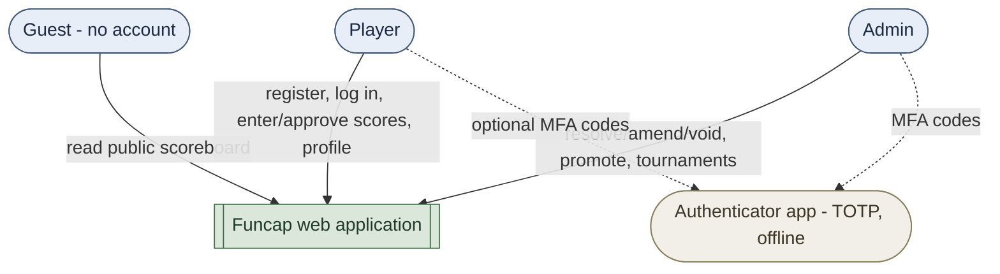
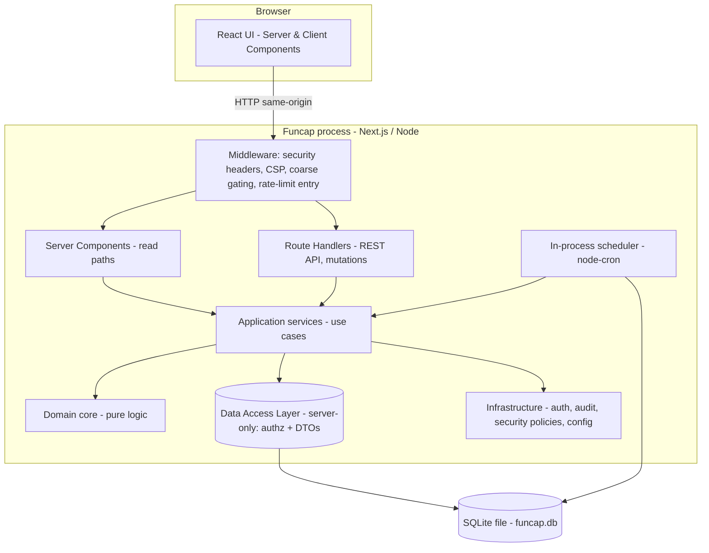
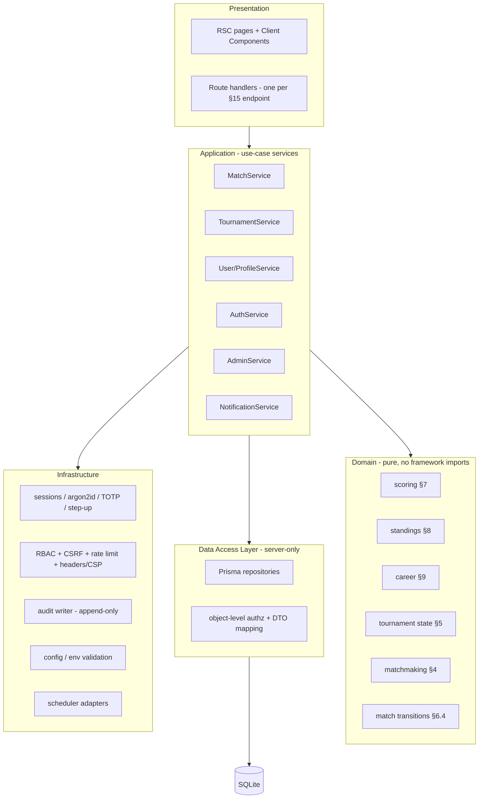
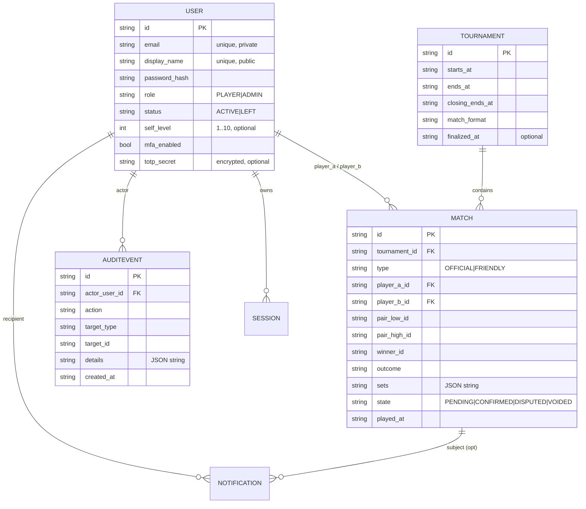
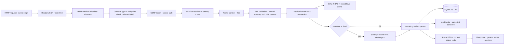
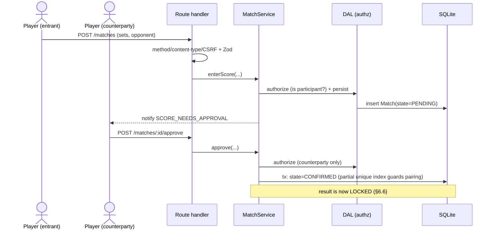
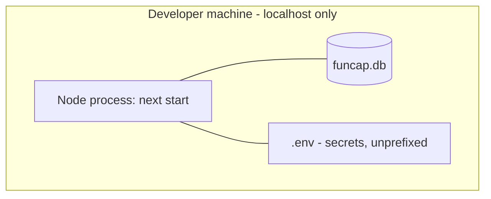

# Funcap — Architecture

Companion to **requirements.md v6**. The requirements define *what* Funcap does; this document defines *how* it is built. Section references like "§6.4" point into requirements.md; this document is otherwise self-contained for structural concerns. Where the two could drift, requirements.md wins on behaviour and this document wins on structure.

The security design (§9) is grounded in two references, both reviewed for this revision: the **OWASP REST Security Cheat Sheet** (applied to the route-handler API surface) and the **Next.js "Thinking about data security" guide** (applied to the App Router data model). §9.5 and §9.6 map each source to a concrete Funcap control.

## 0. About this document

Funcap is a small, security-conscious **Next.js full-stack** web app built to run locally with no internet dependencies (a single Next.js process over a SQLite file). The architecture is deliberately lean: a **layered modular monolith** with a **pure, framework-agnostic domain core**, a **server-only Data Access Layer (DAL)** that is the single boundary for database access and authorization, **server-authoritative** behaviour, and **statistics derived by query rather than stored**. Nothing here assumes a cloud, a cluster, or a message broker; §13 names the few changes needed if that ever changes.

## 1. Architectural drivers & principles

The forces that actually shaped the design:

- **Integrity over a trust-based model.** Scores are self-reported, so correctness lives on the server: validation, the score state machine, the lock-on-confirm rule, and authorization are all enforced server-side and never trusted from the client (§7, §6.4, §6.6, §18.5).
- **Derived truth.** Season standings and career records are pure functions of confirmed official matches (§8–§9). Computing them on read removes a whole class of bugs (stale aggregates, replay-on-void) and is the single most load-bearing decision in the system.
- **Offline, local-first.** One process, one file, no external services at runtime (§16). This favours in-process mechanisms (in-process scheduler, local TOTP, SQLite) and means everything is same-origin (no CORS).
- **One data path, defended in depth.** All data access and authorization flow through a single server-only **DAL** that returns minimal **DTOs**; every HTTP entry point re-verifies auth and authz independently. This follows the Next.js guidance to pick one data-access approach (the DAL) and not mix it, which keeps the code legible to developers and auditors alike.
- **Security proportionate to privilege.** Three trust tiers (guest/player/admin) with a hardened, MFA-gated, fully-audited admin path, expressed as a request pipeline rather than scattered checks (§18).
- **Lean, but honest.** No premature distribution, caching, or event-sourcing. Limitations are explicit and each carries a "revisit when" trigger (§18.11, §13).

Cross-cutting principle: **the domain core knows nothing about HTTP, Prisma, or React**, and **only the DAL knows about secrets and the database.** Everything framework-specific is an adapter around a pure centre.

## 2. Architecture style & non-goals

**Style:** layered modular monolith on Next.js (App Router).

- **Presentation** — React Server Components (read paths) and Client Components, plus the REST route handlers from §15 (the mutation/API surface).
- **Application** — use-case services that orchestrate domain logic, persistence, audit, and notifications, owning transaction boundaries.
- **Domain** — pure TypeScript: score validation, standings/career derivation, tournament-state-from-time, matchmaking ranking, match-transition guards.
- **Data Access Layer (DAL)** — a `server-only` library that is the *sole* place the Prisma client and `process.env` secrets are used; performs authorization adjacent to the data and returns DTOs.
- **Infrastructure** — auth (sessions, argon2id, TOTP), the security layer (RBAC, object-level authz, CSRF, rate limiting, headers/CSP), audit writer, scheduler, config.

**Out of architectural scope for v1** (kept out on purpose): microservices/service mesh, event sourcing / CQRS read models beyond simple derived queries, message queues or event buses, a separate caching tier, container orchestration, and multi-region/multi-instance concerns. Revisited only at the triggers in §13.

## 3. System context (C4 L1)



Funcap has **no outbound integrations**. The only "external" dependency is the user's own offline TOTP authenticator app, which never talks to Funcap directly.

## 4. Container view (C4 L2)

A single deployable process plus a local database file. Browser and server are the **same origin**, so there is no CORS surface.



Reads that render pages go through Server Components → services → DAL; client-side mutations call the REST route handlers, which run the same services → DAL. Behaviour, authorization, and DTO shaping are identical regardless of entry point.

## 5. Internal structure: layers & modules (C4 L3)



Dependency rule: arrows point inward/downward only. The domain imports nothing framework-specific. **The DAL is the only layer importing the Prisma client and reading secrets**; presentation and application never touch the database directly. **Middleware is coarse-grained only** (headers, CSP, redirects, rate-limit entry, presence-of-session) — it is *not* an authorization boundary; real authz happens per-request in the DAL, on the principle that an entry point can always be reached directly.

## 6. Project structure

```
funcap/
  app/                         # Next.js App Router
    (public)/                  # guest-accessible, server-rendered
      scoreboard/page.tsx      # GET season|career view (§10) - DTOs only
      tournaments/[...]/page.tsx
    (auth)/login | register | mfa
    (player)/profile | matches | notifications
    (admin)/board | audit
    api/                       # REST route handlers (§15) - thin; delegate to services/DAL
      auth/{register,login,logout,mfa}/route.ts
      matches/route.ts
      matches/[id]/{approve,reject,resolve,amend,void}/route.ts
      tournaments/route.ts
      admin/{board,audit,users/[id]/promote,users/[id]/reset-password}/route.ts
      notifications/[...]/route.ts
    layout.tsx
  middleware.ts                # headers/CSP, coarse gating, rate-limit entry (NOT authz)
  src/
    domain/                    # pure logic (§7 §8 §9 §5 §4 §6.4) - no I/O, no secrets
      scoring/ standings/ career/ tournament/ matchmaking/ match/
    application/               # use-case services; own transactions
    server/
      dal/                     # 'server-only' Data Access Layer: Prisma + authz + DTOs
      auth/                    # session store, password (argon2id), totp (otplib), step-up
      security/                # rbac policies, csrf, rate-limiter, csp/headers
      audit/                   # append-only AuditEvent writer
      config/                  # env loading + zod validation; the ONLY reader of process.env secrets
      scheduler/               # node-cron jobs (finalize, notifications)
    shared/                    # types + zod schemas + DTO types shared by client and server
  prisma/
    schema.prisma
    migrations/                # incl. raw partial-index migration (§6.2)
    seed.ts                    # first admin + optional sample data
  funcap.db                    # gitignored
  .env                         # gitignored; secrets unprefixed (never NEXT_PUBLIC_*)
```

Modules under `src/server/dal` and `src/server/config` carry `import 'server-only'` so a build error fires if they are ever pulled into a client bundle — keeping the Prisma client, secrets, and authorization logic off the browser.

## 7. Domain core (pure logic)

These modules are plain functions over plain data — no Prisma, no `Request`, no React, no secrets. They are the heart of the system and carry the bulk of the unit tests (§14).

- **scoring** — set and match validity (§7.3–§7.4) for both formats, including retirement/walkover; the single source of truth for "is this a legal tennis result?", reused by score entry and admin amend.
- **standings** — given confirmed official matches in a tournament, produce per-player aggregates and apply the §8 rank order (2-way-only head-to-head, 3+-way fall-through).
- **career** — produce `played/wins/losses/win_pct` and apply the §10 career rank order with the ≥10-match qualification.
- **tournament** — derive state from time (§5.2) and express the finalize rules (which matches auto-void) as pure decisions; the scheduler applies them.
- **matchmaking** — rank candidate opponents by `self_level` proximity then win-% similarity (§4).
- **match (transitions)** — encode the §6.4 state machine: allowed transitions and their guards. Services call this to decide legality before persisting. This is the server-side workflow-state enforcement the OWASP cheat sheet calls for (§9.5, out-of-order execution).

Because standings and career are pure derivations, **void and amend require no special unwind logic** (§9) — the next derivation simply sees a different input set.

## 8. Data architecture

### 8.1 Persistence model

SQLite via Prisma. Domain entities (§14) plus two infrastructure tables (`Session`; rate-limit counters are in-memory, not persisted). `Standing` and the career record are **not** tables — they are query results.



SQLite/Prisma specifics (from §16): enums and JSON are stored as `TEXT` and validated with Zod; UUIDs and timestamps are `TEXT`. `Match` also carries audit/resolution fields (`entered_by_id`, `resolved_by_id`, `amended_by_id`, timestamps), omitted above for readability. **Non-sequential UUIDs** are used for all IDs, which limits resource enumeration (an OWASP REST recommendation) — though object-level authz is the real defence.

### 8.2 DTOs and query safety

- **DTOs at every boundary.** The DAL returns purpose-shaped DTOs, never raw Prisma rows. `password_hash` and `totp_secret` never leave the DAL; `email` is never included in any guest-readable or public response (the scoreboard exposes only `display_name`, results, and standings, §10). This is enforced by shaping in the DAL, not by hoping the caller strips fields — and applies equally to JSON returned by route handlers and to data passed from Server to Client Components.
- **No raw SQL string building.** All queries go through Prisma (parameterised); `$queryRawUnsafe` is prohibited. The only hand-written SQL is the reviewed §6.2 partial-index migration.

### 8.3 Indexes & constraints

- **Partial unique index** enforcing one non-voided official match per pairing per tournament (§6.2), added by a raw migration since Prisma can't express partial indexes.
- Supporting indexes: `Match(tournament_id, type, state)`, `Match(player_a_id)`, `Match(player_b_id)`, `Match(winner_id)`; `Notification(user_id, read)`; `AuditEvent(actor_user_id, created_at)`; `Session(user_id)`.

### 8.4 Transactions

Two invariants drive the transaction boundaries, both owned by the application layer over the DAL:

1. **Confirm is atomic.** Setting a match to `CONFIRMED` runs inside a transaction that relies on the partial unique index to reject a second confirmed official match for the same pairing; the violation is caught and surfaced as a clean error.
2. **A privileged change and its audit row are one unit.** Resolve, amend, void, promote, and reset-password each write their `AuditEvent` **in the same transaction** as the change. There is no code path that mutates a confirmed result without committing an audit entry (§18.6).

### 8.5 Derived statistics

Standings and career are aggregate queries over `Match` filtered by `state = CONFIRMED AND type = OFFICIAL`, fed into the pure ranking functions (§7). Fast at community scale; materialization is deferred until a query is a measured bottleneck (§16) and would be added as an internal read model behind the DAL without touching the domain.

## 9. Request lifecycle & security architecture

Every state-changing request passes through one pipeline; sensitive admin requests pass two extra gates (step-up, audit). Authorization and validation are **server-side and deny-by-default**, and **every entry point re-verifies independently** — a page-level or middleware check never substitutes for the check inside the handler/DAL.



### 9.1 Authentication & step-up

- Server-side sessions resolved from an `httpOnly`/`SameSite=Lax`/`Secure` cookie into identity + role (§18.4). Sessions are **persisted in SQLite** (the `Session` table): restart-safe, with server-side invalidation and rotation as §18.4 requires; this refines the §18.11 "in-memory session" note upward (rate-limit counters remain in-memory).
- We deliberately use **stateful cookie sessions rather than JWTs in JavaScript-readable storage.** The OWASP cheat sheet notes REST's statelessness ideal, but for a first-party browser client an `httpOnly` cookie that JS cannot read is the safer trade-off (no token exfiltration via XSS, true server-side logout). A token model would be reconsidered only for non-browser/third-party API consumers.
- Login verifies argon2id, then — if `mfa_enabled` — issues a TOTP challenge; completion stamps `session.mfa_verified_at`. **Step-up:** sensitive endpoints (§2 †) require `mfa_verified_at` within ≈5 min, else re-challenge. TOTP is local (otplib); secrets are decrypted in-process only when verifying.

### 9.2 Authorization (in the DAL, the IDOR defence)

- **RBAC** maps each route to allowed roles per the §2 matrix, deny-by-default.
- **Object-level checks live in the DAL**, evaluated against the **session identity**, never client-supplied IDs: profile edits require ownership; score entry requires participation; approve/reject requires being the counterparty; edit/withdraw requires being the entrant; resolve/amend/void/act-on-users requires `ADMIN`. Both the Next.js guide and the OWASP IDOR guidance require this ownership check (authorization), not merely "is the user logged in" (authentication).
- **Mass-assignment** is blocked by accepting only an allow-listed set of fields; `role`, `status`, IDs, derived records, and audit fields are never client-settable.

### 9.3 Mutation entry points (route handlers and Server Actions)

§15 defines a **REST route-handler API** as the canonical mutation surface; these are cookie-authenticated, so they carry an explicit **CSRF token** (double-submit) in addition to `SameSite=Lax`, and they apply the REST controls in §9.5. **Server Actions** are a supported alternative for UI-driven mutations and benefit from Next's built-in protections (POST-only, encrypted non-deterministic action IDs, dead-code elimination of unused actions, and an automatic `Origin`-vs-`Host` same-host check). Whichever is used, the rule is identical: **the action/handler stays thin and re-verifies authentication, authorization, and input inside itself, delegating to the `server-only` DAL** — never trusting that it was only reached from our own UI. Mutations are never performed as a render side-effect (no cookie writes or cache revalidation during rendering); they always go through a POST entry point.

### 9.4 Two representative flows

Score entry → approval (lock):



Admin amends a locked match (step-up + audit):

```mermaid
sequenceDiagram
    actor A as Admin
    participant API as Route handler
    participant SEC as Security (RBAC + step-up)
    participant S as MatchService
    participant DB as SQLite

    A->>API: POST /matches/:id/amend (corrected score)
    API->>SEC: RBAC=ADMIN? recent MFA?
    alt MFA stale
        SEC-->>A: 401 step-up required
        A->>API: POST /auth/mfa/verify (TOTP), then retry
    end
    API->>S: amend(...)
    S->>S: re-run score validation (§7)
    S->>DB: tx { update Match (stays CONFIRMED); insert AuditEvent }
    S-->>A: 200; notify both players MATCH_AMENDED
```

### 9.5 OWASP REST Security Cheat Sheet → Funcap controls

| Cheat-sheet guidance | Funcap implementation |
|---|---|
| HTTPS only | TLS + HSTS before any shared deploy (§13); localhost is plain HTTP by accepted limitation (§18.11) |
| Access control at every endpoint | RBAC + object-level authz in the DAL, re-checked per request; middleware is not the boundary (§9.2) |
| Restrict HTTP methods | Route handlers export only their allowed verbs; anything else returns `405` |
| Prevent out-of-order execution | The match (§6.4) and tournament (§5.2) state machines are enforced server-side in the domain/DAL; invalid transitions are rejected — the frontend never enforces sequencing |
| Input validation | Zod at the boundary (length/range/format/type, incl. `[param]` segments and search params); reject unexpected fields; oversized bodies return `413` |
| Validate content types | Mutations require `Content-Type: application/json` (else `415`); the API only produces `application/json`; the `Accept` header is never copied into `Content-Type` |
| Error handling | Generic client errors, no stack traces or internal hints (§12) |
| Audit logs | Append-only `AuditEvent` written around privileged actions; log data sanitised against log injection (§18.6) |
| Security headers | API responses set `Cache-Control: no-store`, `X-Content-Type-Options: nosniff`, `Content-Security-Policy: frame-ancestors 'none'`, correct `Content-Type`; HTML pages get the full CSP (§9.7) |
| CORS | Not needed — browser and API are same-origin; CORS stays disabled. A cross-origin API would require a strict origin allowlist |
| No secrets in URLs | Credentials/tokens never appear in URLs or query strings; resource IDs are non-sequential UUIDs |
| Semantic status codes | `200/201/400/401/403/404/405/409/413/415/429/500` used per their meaning (e.g. `401` unauthenticated vs `403` forbidden; `409` for the pairing-uniqueness conflict) |

### 9.6 Next.js data-security guide → Funcap controls

| Guide guidance | Funcap implementation |
|---|---|
| Pick one data-fetching approach | A single **Data Access Layer** for all reads and mutations; component-level DB access is prohibited |
| DAL is server-only, does authz, returns DTOs | `src/server/dal` carries `import 'server-only'`, performs object-level authz, and returns minimal DTOs (§8.2, §9.2) |
| Only the DAL/secrets layer reads `process.env` | Secrets are read only in `src/server/config` (used by the DAL); no secret is `NEXT_PUBLIC_*` |
| Don't pass private data to Client Components | Server Components pass DTOs only; broad `User`-typed props are disallowed; sensitive fields never cross the boundary |
| Tainting (optional extra layer) | `experimental.taint` may be enabled and sensitive objects/values tainted as defence-in-depth — never a substitute for DAL filtering |
| Treat Server Actions / route handlers as public POST endpoints | Every entry point re-verifies auth + authz + input internally; page-level checks do not extend to them (§9.3) |
| Validate all client input incl. `[param]`, searchParams, headers | Zod validates every external input; bracketed route segments are treated as untrusted (§9.5) |
| Control return values | Handlers/actions return only what the UI needs (DTOs / `{ success: true }`), never raw records (§8.2) |
| No mutation side-effects during render | Mutations only via POST entry points; never in render (§9.3) |
| Rate-limit expensive operations | Auth, registration, and mutation endpoints are rate-limited (§18.10) |
| Server Actions CSRF (`allowedOrigins`, encryption key) | Same-origin in v1; if self-hosted across instances, set `serverActions.allowedOrigins` and a fixed `NEXT_SERVER_ACTIONS_ENCRYPTION_KEY` (§13) |

### 9.7 Headers & CSP placement

The full **Content-Security-Policy** (`default-src 'self'`, no inline scripts via nonce), `Referrer-Policy`, `Permissions-Policy`, `nosniff`, and `frame-ancestors 'none'` are set for the **HTML pages** (Next middleware / `next.config` headers) — most CSP directives only affect HTML. The **JSON API** additionally sets `Cache-Control: no-store` and `nosniff`. `Strict-Transport-Security` is added before any shared deployment (§13). All offline-compatible (no CDN).

## 10. Background processing

Tournament **state** needs no job — it is derived from time on read (§5.2). Only finalize **side-effects** and time-based notifications need scheduling.

- An **in-process scheduler** (node-cron) runs a daily job; it can also be triggered manually via a dev script (no external scheduler, §16).
- **Finalize is idempotent.** It selects tournaments where `now ≥ closing_ends_at AND finalized_at IS NULL`, then in a transaction: auto-voids remaining `PENDING`/`DISPUTED` matches, sets `finalized_at`, and enqueues `TOURNAMENT_FINALIZED` notifications. The `finalized_at` guard makes repeated runs safe (§5.3).
- The same job emits `TOURNAMENT_STARTING` and the `TOURNAMENT_CLOSING` reminders (§12).

## 11. Frontend architecture

- **Server Components** render read-heavy, cacheable pages — above all the public scoreboard (§10), which calls the DAL directly and receives DTOs with no PII.
- **Client Components** handle interactive forms (score entry/approval, profile, MFA enrolment, admin actions) and call the REST route handlers (§15) for mutations. They run under browser security assumptions and **never receive private data or import server-only modules**.
- **Data crossing to the client is always a DTO** (§8.2); component props are narrowly typed to exactly what they render — no whole-`User` props.
- **State** is local React state and server-provided data; no global client store, and **no browser storage of session/auth state** — the session lives in the `httpOnly` cookie.
- **Output encoding:** all user-controlled text (notably the public `display_name`) is rendered through React's default escaping; `dangerouslySetInnerHTML` is prohibited (§18.7). The CSP (§9.7) backstops `javascript:`-URI and injection vectors.
- **Styling:** Tailwind, compiled at build time (no CDN).

## 12. Cross-cutting concerns

- **Configuration & secrets** are loaded once and validated with Zod at startup (fail fast on missing session key, TOTP-encryption key, first-admin seed). **`process.env` secrets are read only in the config/DAL layer**; nothing sensitive is `NEXT_PUBLIC_*`. Secrets are never logged or committed.
- **Error handling:** clients receive generic, non-revealing errors (no stack traces, no enumeration); the server logs structured detail without secrets, tokens, or full session IDs. (`NODE_ENV=production` for any shared deploy so framework error detail is suppressed.)
- **Logging/observability:** security-relevant events (auth failures, privileged actions) are recorded — privileged actions in the durable `AuditEvent` log, the rest in app logs, sanitised against log injection. Metrics/tracing deferred (lean, single-process).

## 13. Deployment & runtime topology



- **Lifecycle:** `npm install` once; `prisma migrate` + `npm run seed` to create the schema and first admin; `npm run dev` (or `build` + `start`) serves UI + API + SQLite entirely offline (§16).
- **Single instance, same origin.** In-memory rate-limit counters and one SQLite writer are intentional for local/test scale; same-origin means no CORS.
- **Path to a shared deployment** (triggers from §18.11 / §13): swap Prisma to PostgreSQL and port the raw partial-index migration; move rate-limit (and, if multi-instance, session) state to shared storage; serve over TLS with HSTS and set `TRUSTED_HOSTS`/`ProxyFix`-equivalent host validation behind a reverse proxy; if Server Actions are used across instances, set `serverActions.allowedOrigins` and a fixed `NEXT_SERVER_ACTIONS_ENCRYPTION_KEY`; enforce admin MFA (remove the local relaxation flag); add email delivery to unlock verification + self-service reset; add a bot defence on public endpoints. None of these touch the domain core or the DAL contract.

## 14. Testing strategy & security audit checklist

Proportionate to risk, heaviest on the pure core and the security gates.

- **Domain unit tests** — exhaustive on `scoring` (every valid/invalid set and match shape, both formats, retire/walkover), plus `standings` (tie-break ordering incl. 2-way vs 3+-way), `career` (threshold, win-% ordering), `tournament` state-from-time, and `match` transition guards. Fast, no I/O.
- **Application/integration tests** — services + DAL against a temporary SQLite: confirm atomicity and the pairing constraint (`409`), void/amend re-derivation, idempotent finalize.
- **Security tests** — authorization/IDOR (a player cannot approve a match they are not the counterparty of, cannot edit another profile, cannot reach admin actions); step-up enforcement on † endpoints; **audit emission** (no privileged mutation commits without its `AuditEvent`); mass-assignment rejection; DTO leakage (no `email`/`password_hash`/`totp_secret` in any client payload); output-escaping of `display_name`; auth throttling/lockout; method `405`, content-type `415`, oversized-body `413`.
- **API contract tests** — each §15 endpoint for status codes, validation errors, and generic-error/anti-enumeration behaviour.
- **Next.js audit checklist** (from the data-security guide) — DB/Prisma and `process.env` are imported only inside the `server-only` DAL; `'use client'` props are not overly broad and expect no private data; route handlers (and any `'use server'` actions) validate inputs, re-authorize, check resource ownership, and filter return values; bracketed `[param]` segments are validated; `route.ts`/middleware get extra scrutiny and periodic pen-testing/scanning.

## 15. Architecture decision summary

Architectural decisions (distinct from the *product* decisions in requirements §17), each with the trigger to revisit.

| # | Decision | Rationale | Revisit when |
|---|---|---|---|
| A1 | Layered **modular monolith**, single Next.js process | Smallest thing that satisfies the requirements; runs offline; clear seams for later extraction | A component needs independent scaling or deploy |
| A2 | **Pure, framework-agnostic domain core** | The trust-critical logic (validation, transitions, ranking) is the part most worth isolating and testing | Never expected to change |
| A3 | **Server-authoritative**; client is UX only | Self-reported scores mean the client cannot be a security boundary | Never |
| A4 | **Statistics derived by query**, not stored | Eliminates stale-aggregate and replay-on-void bugs; void/amend become free (§8.5) | A derivation query is a measured bottleneck → internal read model behind the DAL |
| A5 | **SQLite via Prisma** for now | No external service; matches the offline driver; portable to Postgres later | Shared/multi-instance deployment (§13) |
| A6 | **Sessions persisted in SQLite** (server-side cookie sessions, not JWT-in-JS) | Restart-safe; server-side invalidation/rotation (§18.4); `httpOnly` cookie resists XSS token theft | Non-browser/third-party API consumers → reconsider tokens |
| A7 | **Single server-only Data Access Layer** as the data + authz boundary, returning DTOs | Follows the Next.js "pick one approach" guidance; centralises authorization adjacent to data; the only reader of Prisma + secrets; prevents private-data leakage to the client | Never expected to change |
| A8 | **Middleware is coarse-only; authz re-checked per entry point** | Middleware can be bypassed/misconfigured; every route handler/Server Action is an independent public entry point (OWASP + Next.js guidance) | Never |
| A9 | **REST route handlers are the canonical mutation surface; Server Actions a supported alternative** | Matches the documented §15 API and the OWASP REST controls; both stay thin over the DAL and re-verify internally | If the UI standardises on Server Actions, keep both contracts in sync |
| A10 | **Security as a deny-by-default request pipeline** (headers→method→content-type/size→CSRF→session→validate→authz→step-up→service→audit→DTO) | One consistent path; no scattered ad-hoc checks; sensitive actions provably audited | New surface or role; integrate into the same pipeline |
| A11 | **In-process scheduler**, idempotent finalize via `finalized_at` | No external scheduler at runtime; safe under repeated runs | Need cross-instance scheduling → external scheduler |
| A12 | **Shared Zod schemas** client+server; **DTO types** in `shared/` | Same validation for UX and authority; one source of truth for shapes | Never expected to change |