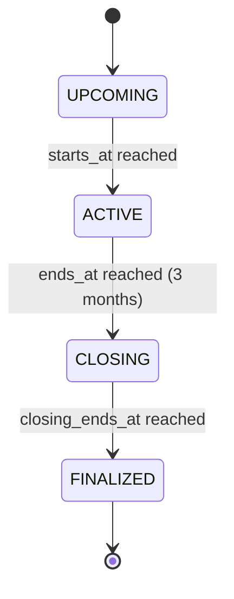
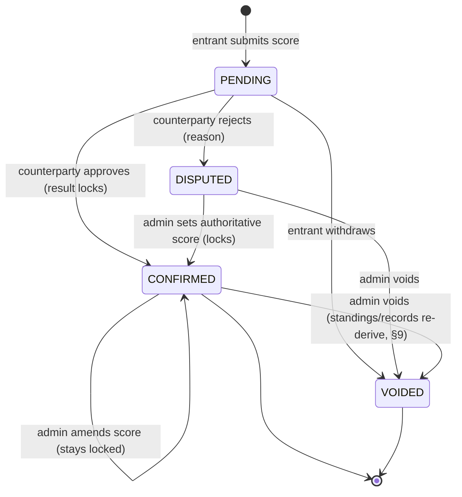

# Funcap — Requirements Specification (v6, build-ready, decisions resolved)

This document supersedes the earlier draft. It is written to be **self-contained**: an implementer reading only this file should be able to build the application without referring to any prior discussion. **All decisions previously left open are now resolved — see §17.** Security requirements are in §18; a high-level change log is in §19.

## 0. Conventions

- **Timestamps:** ISO 8601, stored in UTC.
- **Units:** metric for any physical profile measures.
- **IDs:** UUID v4 unless stated.
- **Scope of v1:** singles tennis only. See §13 (Non-goals).
- **Defaults:** an inline "(default)" marks a default field value (e.g. a new match's state). The resolved policy choices the build ships with are summarised in §17; all remain configurable in code.

## 1. Overview

Funcap is a **trust-based community web application** for organizing self-reported singles tennis matches across a continuous series of **3-month tournaments**. It provides per-tournament standings, a career win/loss record, a two-party score-confirmation flow with admin dispute resolution, and a public global scoreboard.

- **Type:** web application (server-rendered + API), runnable entirely on localhost (§16).
- **Trust model:** scores are self-reported and socially accountable. No photo evidence, GPS check-in, or umpires. Integrity is upheld by (a) two-party confirmation, (b) the one-match-per-pairing rule, (c) locking confirmed results so only an admin can change them, (d) admin dispute resolution, (e) lightweight suspicious-activity flags, and (f) role-based access control with hardened, MFA-protected, fully-audited admin privileges (§18).
- **Tournament series:** sequential, non-overlapping tournaments of 3 months each. Per-tournament standings reset each tournament; each player's win/loss record accumulates across the whole series for a career view.
- **Ranking model:** plain and transparent — a win scores a point. No skill-rating system (no Elo/Glicko). Season standings rank by points (= wins) with tiebreakers; the career board ranks by win percentage with a minimum-matches threshold. See §8–§10.

## 2. Roles & Permissions

Three trust levels: **GUEST** (unauthenticated, no account), **PLAYER** (default authenticated role), and **ADMIN** (elevated). The scoreboard is public — guests need no account and can only read it.

| Action | Guest | Player (participant) | Player (counterparty) | Admin |
|---|---|---|---|---|
| View global scoreboard (season + career) | ✓ | ✓ | ✓ | ✓ |
| Register / log in | ✓ | — | — | — |
| View/edit own profile | — | ✓ | ✓ | ✓ |
| Enrol / manage own MFA | — | ✓ | ✓ | ✓ (mandatory, §18.3) |
| Get matchmaking suggestions | — | ✓ | ✓ | ✓ |
| Enter a match score | — | ✓ (as entrant) | — | ✓ |
| Edit / withdraw a pending score | — | ✓ (entrant only, while PENDING) | — | ✓ |
| Approve / reject a score | — | — | ✓ (counterparty only) | ✓ |
| Resolve a disputed match (set score / void) | — | — | — | ✓ † |
| Amend a confirmed (locked) match's score | — | — | — | ✓ † |
| Void a confirmed match | — | — | — | ✓ † |
| Reset a player's password | — | — | — | ✓ † |
| Promote a user to ADMIN | — | — | — | ✓ † |
| Create / configure a tournament | — | — | — | ✓ † |
| View admin board + flags + audit log | — | — | — | ✓ |

The admin role is intentionally thin: admins act on disputes, on correcting locked results, and on tournament lifecycle — not on routine matches.

**† Sensitive actions.** Actions that change a confirmed result or grant/alter access (resolve, amend, void, reset password, promote, create tournament) are *sensitive*: they require admin **MFA step-up re-authentication** (§18.3) and are written to the **append-only audit log** (§18.6).

## 3. Authentication & Account Lifecycle

- **Registration fields:** `email` (unique, login identifier — kept private, never shown publicly), `display_name` (unique, the only public identifier), `password`.
- **Password policy & hashing:** NIST-aligned (see §18.2); stored with argon2id.
- **Multi-factor auth:** TOTP (RFC 6238), offline-capable. **Optional for players, mandatory for admins** (§18.3).
- **Sessions:** server-side sessions via an httpOnly, SameSite=Lax, Secure cookie. CSRF protection on all cookie-authenticated mutations (§18.4).
- **Login protection:** rate limiting plus lockout/backoff, with generic error messages to limit account enumeration (§18.2).
- **Password reset:** self-service reset needs email and is deferred (email is a non-goal, §13). In v1 an **admin resets a player's password** (issues a one-time temporary credential the user must change at next login).
- **First admin:** seeded at deploy time from a configured secret/env value; thereafter admins promote other users (a sensitive, audited action).
- **Account status:** `ACTIVE` or `LEFT`. A `LEFT` user keeps their historical matches and remains on the career board but cannot log in, be scheduled, or appear in matchmaking.

The full security requirements are in §18.

## 4. Matchmaking ("Match Dating")

- Endpoint returns a ranked list of **suggested opponents** for the current user, sorted by closeness of the optional **1–10 self-rating** (`self_level`, where 1 = new and 10 = highly competitive); among players at a similar level, those with a similar career win % rank first. Players who have not set a level fall back to win-%-based proximity.
- Matchmaking **suggests but never restricts**: any two ACTIVE users may arrange a match — the app does not wall off cross-level play.
- Suggestions intended for an **official** match exclude opponents the user has already played an official match against in the **current** tournament (since a second official match against them is not permitted — see §6).
- `LEFT` users and the current user are never suggested.

## 5. Tournaments

### 5.1 Fields

| Field | Type | Notes |
|---|---|---|
| `id` | UUID | |
| `name` | string | |
| `starts_at` | timestamp | |
| `ends_at` | timestamp | = `starts_at` + 3 months (enforced on create) |
| `closing_ends_at` | timestamp | = `ends_at` + 7 days (the closing window) |
| `match_format` | enum | `BEST_OF_3_FULL` (default) \| `BEST_OF_3_SUPER_TB` |
| `finalized_at` | timestamp? | set when finalize side-effects have run |

### 5.2 Lifecycle (state is derived from time)

State is a **pure function of the current time**, not a stored mutable field:

- `UPCOMING` — `now < starts_at`
- `ACTIVE` — `starts_at ≤ now < ends_at` (matches may be played, entered, and approved)
- `CLOSING` — `ends_at ≤ now < closing_ends_at`. No further matches may be **played** in this tournament, but results of matches already played in the ACTIVE window may still be **entered, approved, or disputed**, and the admin may resolve disputes.
- `FINALIZED` — `now ≥ closing_ends_at`



### 5.3 Finalize side-effects (one-time job at `closing_ends_at`)

When a tournament transitions into `FINALIZED` (detected by a scheduled job), exactly once:

1. **Auto-void** every still-`PENDING` or `DISPUTED` match in that tournament (see §17 #4 for why auto-void rather than blocking).
2. Freeze per-tournament standings (no further confirmed official matches can attach to it; see §5.4).
3. Send `TOURNAMENT_FINALIZED` notifications.
4. Set `finalized_at`.

Note: admins may still **amend or void** already-`CONFIRMED` matches after finalize (§6.6) to correct an error; standings re-derive automatically.

### 5.4 Series invariant & match attachment

Tournaments are **sequential and non-overlapping**: at most one tournament is in `ACTIVE` or `CLOSING` at any time. A match belongs to the tournament whose **ACTIVE window contains its `played_at`** — unambiguous, given non-overlap. (The next tournament's `starts_at` is therefore ≥ the previous tournament's `closing_ends_at`, leaving a short between-tournament gap in which only friendlies can be played.)

## 6. Matches & Scoring

### 6.1 Match types

- **OFFICIAL** — counts toward tournament standings and the career record.
- **FRIENDLY** — never affects standings or the career record; unlimited in number.

### 6.2 One-match-per-pairing rule (anti-farming & anti-duplication)

At most **one non-`VOIDED` OFFICIAL match per unordered player pair, per tournament.** To make this a trivial database constraint, each match stores a **normalized pair**: `pair_low_id = min(player_a_id, player_b_id)`, `pair_high_id = max(...)`. Enforce with a partial unique index on `(tournament_id, pair_low_id, pair_high_id)` where `type = OFFICIAL AND state <> VOIDED`, plus an application-level check on entry.

Covering every non-`VOIDED` state (`PENDING`/`DISPUTED`/`CONFIRMED`), rather than only `CONFIRMED`, prevents two concurrent entries for the same pairing and the race condition at confirm time. A `VOIDED` match never blocks a fresh entry — so if an admin voids a disputed match, the players may replay and re-enter.

Players may meet again in the same tournament, but any further meeting can only be a **FRIENDLY** match. This is the primary anti-farming mechanism: there is no value in repeatedly beating the same opponent. Across **different** tournaments the same pair may play one official match each.

### 6.3 Fields

| Field | Type | Notes |
|---|---|---|
| `id` | UUID | |
| `tournament_id` | FK → Tournament | the tournament whose ACTIVE window contains `played_at` (§5.4) |
| `type` | enum | `OFFICIAL` (default) \| `FRIENDLY` |
| `player_a_id` | FK → User | initiator (ordering convention only) |
| `player_b_id` | FK → User | `player_a_id ≠ player_b_id` |
| `pair_low_id` / `pair_high_id` | FK → User | normalized sorted pair (derived) |
| `entered_by_id` | FK → User | must be `player_a_id` or `player_b_id` |
| `outcome` | enum | `COMPLETED` (default) \| `RETIRED` \| `WALKOVER` |
| `retired_by_id` | FK → User? | required iff `outcome = RETIRED` |
| `winner_id` | FK → User | must be a participant; derived from score/outcome |
| `sets` | JSON | ordered array of set objects (see §7); empty for `WALKOVER` |
| `state` | enum | `PENDING` (default) \| `CONFIRMED` \| `DISPUTED` \| `VOIDED` |
| `dispute_reason` | text? | set when counterparty rejects |
| `played_at` | timestamp | when the match occurred; must fall in the tournament's ACTIVE window (`starts_at ≤ played_at < ends_at`) |
| `entered_at` | timestamp | creation time; may be during ACTIVE or CLOSING |
| `resolved_at` | timestamp? | confirm/void time |
| `resolved_by_id` | FK → User? | approver, or admin for dispute resolution/void |
| `amended_by_id` | FK → User? | admin who last corrected a CONFIRMED (locked) match (§6.6) |
| `amended_at` | timestamp? | time of the last admin correction |

### 6.4 Scoring state machine



Transition rules:
- Either participant may **enter** the score; the **counterparty** (the participant who did not enter) approves or rejects. The entrant may **edit or withdraw** while PENDING; an edit keeps the match PENDING and re-requires approval.
- **Entry** is allowed during `ACTIVE` or `CLOSING` (for a match played in the ACTIVE window). **Approval** and **dispute resolution** are allowed during `ACTIVE` or `CLOSING`.
- On confirmation the result is **locked** (see §6.6): the players can no longer change it, and only an admin can amend or void it thereafter.
- Dispute resolution, amending a confirmed match, and voiding are **admin-only** sensitive actions (§18.3, §18.6).
- On confirm of an OFFICIAL match, the §6.2 constraint guarantees uniqueness; on success it counts toward standings (§8) and the career record (§9).

### 6.5 Effect on standings & records

Only **OFFICIAL + CONFIRMED** matches count toward tournament standings (§8) and the career record (§9). FRIENDLY matches never count, and PENDING/DISPUTED/VOIDED matches never count. By outcome:

| Outcome | Counts as |
|---|---|
| `COMPLETED` | win for the winner, loss for the loser |
| `RETIRED` | win for the non-retiring player, loss for the retiree |
| `WALKOVER` | win for the player who showed, loss for the no-show |

All three outcomes count identically toward both the season standings and the career win/loss record.

### 6.6 Locking & admin correction

When a match becomes `CONFIRMED` — both participants have agreed, since one entered the score and the other approved it — the result is **locked**. Neither participant may edit, withdraw, re-dispute, or delete a locked match. Only an **admin** can change it, via one of two actions:

- **Amend** — the admin opens the locked match, sets a corrected score/outcome, and saves. The match **stays `CONFIRMED`** (re-locked); the new score is authoritative and requires **no re-approval** by the players. The admin and time are recorded in `amended_by_id` / `amended_at`, and both participants receive a `MATCH_AMENDED` notification (§12).
- **Void** — the admin invalidates the match (`CONFIRMED → VOIDED`); it stops counting.

Both are **sensitive actions** (§18.3): they require admin MFA step-up and are written to the append-only audit log (§18.6). Either action updates season standings and career records **automatically** (both are derived, §8–§9) with no replay step. Amending or voiding remains possible after a tournament is `FINALIZED`, to correct genuine errors.

## 7. Tennis Score Model & Validation

### 7.1 Set object

```
{ a: int ≥ 0, b: int ≥ 0, tb_a?: int, tb_b?: int }
```
`tb_*` are optional tiebreak points within a 7–6 set, or the match-tiebreak points for a super-tiebreak decider.

### 7.2 Match format

- `BEST_OF_3_FULL` (default) — best of 3 full sets; a 7-point tiebreak settles 6–6 in **every** set.
- `BEST_OF_3_SUPER_TB` — best of 3, but the deciding 3rd set is a **10-point match tiebreak** (win by 2).

### 7.3 Set validity

For a standard set (any set under `_FULL`; sets 1–2 under `_SUPER_TB`), with `hi = max(a,b)`, `lo = min(a,b)`:

- `hi == 6 AND lo ≤ 4 AND hi − lo ≥ 2` (i.e. 6–0 … 6–4), **or**
- `{hi, lo} == {7, 5}`, **or**
- `{hi, lo} == {7, 6}` (tiebreak set; if `tb_*` given, the set winner's tiebreak points ≥ 7 and win-by-2)

For the **deciding 3rd set under `_SUPER_TB`**: `hi ≥ 10 AND hi − lo ≥ 2`.

Advantage sets beyond 7–6/7–5 (e.g. 8–6) are invalid.

### 7.4 Match validity

- Sets are stored in play order.
- `COMPLETED`: the winner has **exactly 2** sets; total sets ∈ {2, 3}; no set may follow a 2–0 lead; every set is valid per §7.3; `winner_id` = the player with 2 sets.
- `RETIRED`: completed sets must each be valid; an optional final in-progress set may be partial (no §7.3 constraint); `retired_by_id` required; `winner_id` = the non-retiring participant; the "2 sets" requirement does **not** apply.
- `WALKOVER`: `sets` empty; `winner_id` required; loser is the other participant.

**All score validation is server-side and authoritative.** The client never decides validity, the winner, or the tournament a match attaches to. The same validation runs on an admin amendment (§6.6).

## 8. Season Standings (per tournament, derived)

Standings are **derived** from CONFIRMED OFFICIAL matches in the tournament (computed on read; materialize only if performance requires). Per `(tournament_id, user_id)`: `played, wins, losses, sets_for, sets_against, games_for, games_against`.

Scoring is points-based: **a win scores 1 point**, a loss scores 0, so a player's season points equal their season wins.

**Rank order** (descending priority):

1. Points (= wins; more is better)
2. Head-to-head result — only to break an exact **two-player** tie where the two met (the winner ranks higher). Ties among three or more players skip this step, since a 3-way head-to-head can be circular.
3. Set difference (`sets_for − sets_against`)
4. Game difference (`games_for − games_against`)
5. Fewer losses
6. `display_name` alphabetical (final deterministic tiebreak)

Within a single 3-month tournament, ranking by points rewards playing more matches — which is intentional for a time-boxed competition. (The volume-vs-efficiency concern is handled differently for the persistent career board; see §10.)

## 9. Player Career Record (derived)

A player's career record is **derived** from all their CONFIRMED OFFICIAL matches across the whole series (every tournament), computed on read. It is **not** stored on the user, and there is no skill-rating number.

Per user:
- `career_played` — count of confirmed official matches
- `career_wins`, `career_losses`
- `career_win_pct` = `career_wins / career_played` (defined as 0 when `career_played = 0`)

Because both season standings (§8) and career records are pure functions of the set of CONFIRMED OFFICIAL matches, **voiding or amending a match needs no replay or recomputation step**: changing the set updates both automatically on the next read. There is no rating history to reconstruct and no sequential state to unwind.

## 10. Global Scoreboard

Public, community-wide (single league table, not per-club). Two views:

- **This season** — standings within the current tournament (§8); resets each tournament. A win is 1 point, so season points equal season wins; the §8 tiebreakers order players who are level on points.
- **Career** — win/loss record across the whole series (§9).

**Career rank order** (descending priority):

1. Win % (`career_win_pct`)
2. More matches played (`career_played`) — the more proven of two players level on win %
3. `display_name` alphabetical (final deterministic tiebreak)

To stop a 1–0 player from outranking a 30–5 player, only players with at least **10 career matches** are ranked. Players below the threshold are listed separately as **"unranked"** (their record is shown, but they receive no rank). At launch and early in a tournament the season (points) board is the populated, live headline, so the career board can carry a higher bar that makes its win % meaningful. The threshold is configurable and can be lowered for a small or new community.

The public scoreboard exposes only `display_name`, results, and standings — never `email` or any other PII (§18.8).

## 11. Admin Board & Flags

The admin board lists the dispute queue (all `DISPUTED` matches), the audit log (§18.6), and surfaces lightweight, **non-blocking** suspicious-activity flags (computed; manual review only):

- **FAST_CONFIRM** — an OFFICIAL match confirmed `< 60 s` after entry (possible auto/colluded approval).
- **EXCLUSIVE_PAIR** — two users whose only official matches across the series are against each other.

These two rules ship in v1; thresholds are configurable. There are no automated penalties — flags inform manual review only.

## 12. Notifications (in-app only, v1)

Events delivered as in-app notifications: `SCORE_NEEDS_APPROVAL`, `SCORE_CONFIRMED`, `SCORE_DISPUTED`, `DISPUTE_RESOLVED`, `MATCH_AMENDED`, `TOURNAMENT_STARTING`, `TOURNAMENT_CLOSING`, `TOURNAMENT_FINALIZED`. Fields: `user_id`, `type`, `match_id?`, `read`, `created_at`.

- `MATCH_AMENDED` is sent to both participants when an admin corrects a locked (CONFIRMED) match (§6.6).
- `TOURNAMENT_CLOSING` is sent when a tournament enters `CLOSING`, and again 48 h before `closing_ends_at`, to any participant or admin with a `PENDING` or `DISPUTED` match, so it can be resolved before the deadline auto-voids it (§5.3). The 48 h lead time is configurable.

## 13. Non-goals (explicitly out of scope for v1)

To keep the build lean: skill-rating systems (Elo/Glicko and the like), doubles/teams, native mobile apps, real-time/live scoring or websockets, OAuth/social login, email or push delivery (and therefore self-service password reset), in-app messaging/chat, court booking or calendar scheduling, payments/subscriptions, multiple concurrent tournaments, and internationalization. Each is a candidate for a later version, not v1.

## 14. Data Model Summary

- **User** — id, email (unique, private), display_name (unique, public), password_hash (argon2id), must_change_password (bool, set after an admin reset), role (`PLAYER`/`ADMIN`), status (`ACTIVE`/`LEFT`), self_level (optional integer 1–10), mfa_enabled (bool, default false; must be true for `ADMIN`), totp_secret (text?, **encrypted at rest**, §18.8), failed_login_count + locked_until (login throttling, §18.2), created_at, updated_at.
- **Tournament** — §5.1.
- **Match** — §6.3.
- **Notification** — §12.
- **AuditEvent** — append-only privileged-action log (§18.6): id, actor_user_id (FK → User), action (e.g. `DISPUTE_RESOLVED`, `MATCH_AMENDED`, `MATCH_VOIDED`, `USER_PROMOTED`, `PASSWORD_RESET`, `TOURNAMENT_CREATED`, `LOGIN_FAILED`), target_type, target_id, details (JSON: relevant before/after values), reason (text?), ip (text?), created_at.
- **Standing & career record** — both **derived** (§8, §9) from confirmed official matches; not stored tables unless materialized for performance.

## 15. API Surface (REST, indicative)

| Method | Path | Auth | Notes |
|---|---|---|---|
| POST | `/auth/register` | guest | |
| POST | `/auth/login` | guest | returns `mfa_required` when the account has MFA enabled |
| POST | `/auth/mfa/verify` | guest (mid-login) | submit TOTP code to complete login |
| POST | `/auth/logout` | player | invalidates the session |
| POST | `/auth/mfa/setup` / `/auth/mfa/activate` | player | enrol TOTP (provisioning URI/QR generated locally) and confirm |
| GET | `/me` | player | profile + record + notifications count |
| PATCH | `/me` | player | edit own profile (incl. `self_level`); change own password |
| GET | `/matchmaking/suggestions?type=official\|friendly` | player | §4 |
| POST | `/matches` | player | enter score → PENDING (`played_at` must be in an ACTIVE window) |
| PATCH | `/matches/:id` | player | edit pending (entrant only) |
| DELETE | `/matches/:id` | player | withdraw pending (entrant only) → VOIDED |
| POST | `/matches/:id/approve` | player | counterparty only → CONFIRMED (locks the result) |
| POST | `/matches/:id/reject` | player | counterparty only → DISPUTED (reason) |
| POST | `/matches/:id/resolve` | admin † | DISPUTED → set authoritative score → CONFIRMED |
| POST | `/matches/:id/amend` | admin † | CONFIRMED (locked) → corrected score, stays CONFIRMED (§6.6) |
| POST | `/matches/:id/void` | admin † | → VOIDED (standings/records auto-update; no replay) |
| GET | `/scoreboard?view=season\|career` | guest | public; no PII |
| GET | `/tournaments` / `/tournaments/:id` | guest | includes derived state |
| POST | `/tournaments` | admin † | create (enforces 3-month span, non-overlap) |
| GET | `/admin/board` | admin | dispute queue + flags |
| GET | `/admin/audit` | admin | append-only audit log (§18.6) |
| POST | `/admin/users/:id/promote` | admin † | grant ADMIN |
| POST | `/admin/users/:id/reset-password` | admin † | issue temporary credential; sets `must_change_password` |
| GET | `/notifications` / POST `/notifications/:id/read` | player | |

**† Sensitive endpoints** require admin MFA step-up re-authentication (§18.3) and write an `AuditEvent` (§18.6). All endpoints enforce object-level authorization server-side (§18.5).

## 16. Implementation Profile (recommended; requirements above are stack-agnostic)

- **Language:** TypeScript end-to-end (shared types client↔server).
- **Framework:** Next.js (App Router) full-stack — single deployable, runs on localhost. *(Alternative: Vite + React front, Fastify back.)*
- **Database:** **SQLite** — a single local file (e.g. `funcap.db`) for local development and testing, with **no external database service**. The schema is portable to PostgreSQL later via a Prisma datasource change (the raw partial-index migration below would get a Postgres variant).
- **ORM:** Prisma with the SQLite provider. SQLite-specific notes:
  - The §6.2 partial unique index is added via a **raw migration**. SQLite supports partial indexes, so `CREATE UNIQUE INDEX ... ON "Match"(tournament_id, pair_low_id, pair_high_id) WHERE type = 'OFFICIAL' AND state <> 'VOIDED'` works as written.
  - Prisma's SQLite provider has **no native enum or Json type**: enum columns are stored as `TEXT`, the `sets` array and `AuditEvent.details` are stored as **JSON strings** (`TEXT`), and UUIDs/timestamps are stored as `TEXT`. All are validated in the app layer (Zod).
- **Security libraries:** argon2 (hashing), otplib (offline TOTP), a CSRF token helper, an in-memory/SQLite-backed rate limiter (offline-safe for a single instance), Zod (validation). Security headers/CSP are set in the framework config (offline; no CDN). TOTP secrets are encrypted (AES-256-GCM) with an app key from the environment before storage (§18.8).
- **Auth:** server sessions (httpOnly cookie), argon2id hashing, CSRF tokens — all local, no third-party identity provider.
- **Validation:** Zod schemas shared between client and server; score validation (§7), enum/JSON checks, and the admin-amend path (§6.6) reuse one shared pure module.
- **Standings & records:** derived by query from confirmed official matches; voiding or amending a match needs no replay. Cache or materialize only if a query becomes a bottleneck.
- **Local development & runtime (offline):** the app runs **entirely on localhost with no internet dependencies at runtime** — no external APIs, CDNs, cloud database, third-party auth, email, or push. Dependencies are installed once with `npm install`; thereafter `npm run dev` serves the full app (UI + API + SQLite) offline. Tailwind compiles at build time, not from a CDN. A `seed` script creates the first admin (and optional sample players/tournament) so the app is testable immediately. SQLite's single-writer model is more than sufficient at local/test scale.
- **Scheduled work:** tournament state is derived on read; the finalize side-effects (§5.3) and the `TOURNAMENT_STARTING` / `TOURNAMENT_CLOSING` / `TOURNAMENT_FINALIZED` notifications run from a simple in-process scheduler (e.g. `node-cron`) or a manual dev script — no external scheduler service.
- **Styling:** Tailwind.

## 17. Resolved decisions & rationale

All decisions previously left open are now fixed. They remain configurable in code, but these are the committed choices the build ships with.

| # | Decision | Choice | Rationale |
|---|---|---|---|
| 1 | Match format default | `BEST_OF_3_FULL` | Least-surprising, canonical "best of 3 sets"; fits standard club singles. `BEST_OF_3_SUPER_TB` (10-point match tiebreak for the 3rd set) stays a per-tournament override for organizers who want to cap match length. This is the decision most tied to local taste, and it is one field to change. |
| 2 | Closing window | 7 days | Long enough to resolve last-week approvals and disputes, short enough to keep the between-tournament gap brief. Series cadence is 3 months + 7 days per cycle. |
| 3 | Matchmaking | Suggest only; never restrict | A community app should not block a beginner and an advanced player from arranging a match. Suggestions already sort by level proximity, which nudges without walling. |
| 4 | Unresolved matches at finalize | Auto-void | Tournament state is a pure function of time (§5.2); making finalize wait on an empty admin queue would let a single unresolved dispute freeze the tournament — and, because tournaments don't overlap, freeze the whole series. Players get the full 3 months plus 7 days, plus closing reminders (§12), before anything is voided. |
| 5 | Career ranking threshold | ≥ 10 career matches | The season (points) board is the populated, live headline, especially at launch; the career board is deliberately the "proven players" view, so a higher bar makes its win % meaningful. Tunable; lower it for a very small or brand-new community. |
| 6 | Doubles | Out of scope for v1 | Doubles needs a partnership/team model and its own pairing rules — real scope, deferred. v1 is singles only. |
| 7 | Admin-override audit log | Required (§18.6) | Was previously optional. Because an admin can silently change a result both players approved, an append-only audit trail of privileged actions is a baseline accountability control, not gold-plating. |

Refinements made in earlier revisions (correctness/clarity, not new scope):

- **Match entry vs play window (§5.2, §5.4, §6.3):** `played_at` must fall inside the ACTIVE window, but results may be *entered, approved, or disputed* during ACTIVE **or** CLOSING.
- **Duplicate-entry safety (§6.2):** the one-per-pairing uniqueness constraint covers every non-`VOIDED` state, not just `CONFIRMED`.
- **Closing reminders (§12):** `TOURNAMENT_CLOSING` notifications nudge stragglers before the deadline auto-voids.
- **Self-rating scale (§4, §14):** `self_level` is a concrete optional integer 1–10.
- **Multi-way standings ties (§8):** head-to-head breaks only exact two-player ties; 3+ way ties skip to set difference.

## 18. Security Requirements

### 18.1 Approach & trust model

- **Three trust levels (§2):** GUEST (unauthenticated, no account, read-only public scoreboard), PLAYER (standard authenticated user), ADMIN (elevated, hardened).
- **Least privilege & deny-by-default:** every endpoint denies access unless the caller's role and object-level ownership explicitly permit it. Admins receive only the capabilities in §2.
- **Server-side enforcement:** all authentication, authorization, and validation are enforced on the server. Client-side hiding of controls is UX only and never a security boundary.
- **Reference baseline:** OWASP ASVS L1 throughout, L2 for the authentication, session, access-control, and privileged-admin areas below.
- **Local vs deployed:** controls below are split into **always-on** (work fully offline on localhost) and **before any shared/non-local deployment** (§18.9). The local/offline limitations accepted for v1 are listed in §18.11.

### 18.2 User authentication (the usual user/password requirements)

- **Identifier + secret:** email (unique, private) + password.
- **Password policy (NIST SP 800-63B aligned):** minimum length 12, allow at least 64, allow all printable Unicode incl. spaces; **no composition mandates and no periodic expiry**; screen new/changed passwords against a bundled list of common/breached passwords and reject matches. No password hints or knowledge-based questions.
- **Storage:** argon2id with tuned memory/time cost; never store or log plaintext or reversible passwords.
- **Login throttling & lockout:** per-account and per-IP rate limiting with exponential backoff; temporary lockout after repeated failures (`failed_login_count` / `locked_until`). Failed logins are recorded (§18.6).
- **Anti-enumeration:** login, registration, and reset responses are generic and constant-ish in timing — they do not reveal whether an email exists.
- **Optional MFA:** any player may enrol TOTP (§18.3 mechanism).
- **Password reset:** admin-assisted in v1 (§3) — the admin issues a one-time temporary credential and sets `must_change_password`, forcing a change at next login. Self-service email reset is deferred (§13).
- **Session establishment:** a new session is issued on login and the session ID is rotated on any privilege change.

### 18.3 Admin authentication & elevated controls (stronger requirements)

- **Mandatory MFA:** every `ADMIN` account must have TOTP enabled (`mfa_enabled = true`). Promotion to admin is incomplete until MFA is enrolled; an admin with MFA disabled cannot perform sensitive actions. (For a purely local single-developer test run, MFA may be relaxed via an explicit, off-by-default config flag — never in a shared/production deployment.)
- **Step-up re-authentication:** every **sensitive action** (§2 † — resolve, amend, void, reset password, promote, create tournament) requires a fresh MFA/credential challenge completed within a short window (e.g. 5 minutes); otherwise the user is re-challenged.
- **Tighter sessions:** admin sessions have shorter idle and absolute timeouts than player sessions.
- **Individual accountability:** no shared admin accounts — each admin is a distinct user so every privileged action is attributable in the audit log (§18.6).
- **Bounded admin set:** the number and identity of admins are visible to admins on the admin board; promotion and the seeded first admin are themselves audited events.

### 18.4 Session management & CSRF

- Sessions are server-side; the cookie is `httpOnly`, `SameSite=Lax`, and `Secure`. Session IDs are high-entropy and opaque.
- Idle and absolute timeouts apply (shorter for admins, §18.3); logout invalidates the session server-side; session IDs rotate on login and privilege change.
- All cookie-authenticated state-changing requests carry a CSRF token (double-submit or synchroniser pattern), validated server-side.

### 18.5 Authorization & access control (incl. IDOR)

- **RBAC** on every endpoint per the §2 matrix, deny-by-default.
- **Object-level authorization (no IDOR):** ownership and relationship checks are keyed to the **authenticated session identity**, never to client-supplied IDs. Concretely: a player may edit only their own profile; only a match **participant** may enter a score; only the **counterparty** may approve/reject; only the **entrant** may edit/withdraw a pending match; only an **admin** may resolve/amend/void or act on other users. Every match/profile/user reference is verified against the caller before any read or mutation that exposes or changes non-public data.
- **Mass-assignment protection:** mutations accept only an explicit allow-list of fields; role, status, ratings/records, IDs, and audit fields are never client-settable.

### 18.6 Privileged-action accountability (audit log)

- An **append-only `AuditEvent` log** (§14) records every sensitive action: dispute resolution, amend, void, promote, password reset, tournament creation — plus failed logins and MFA changes. Each entry captures actor, action, target, relevant before/after values, optional reason, IP, and timestamp.
- The log is **append-only** (no update/delete via the application) and readable by admins (`GET /admin/audit`).
- Score corrections to locked matches (§6.6) must always produce an entry, so a player-approved result can never be changed without a trace.

### 18.7 Input validation & output encoding

- **Validate all input server-side** with shared Zod schemas (scores §7, `self_level` range, email format, etc.); reject rather than coerce malformed input.
- **`display_name` is user-controlled and shown on the public scoreboard** → a stored-XSS sink reaching guests. Restrict it to a sane charset and length, store it as plain text, and rely on contextual output encoding (React escapes by default; **no `dangerouslySetInnerHTML`**, no raw HTML injection anywhere).
- **No raw SQL string concatenation:** all queries go through the ORM (parameterised); the only hand-written SQL is the reviewed §6.2 index migration.

### 18.8 Data protection & privacy

- **PII minimisation:** the app stores only email, display_name, password hash, and TOTP secret. **Email is private** and never returned on any guest-accessible or public endpoint; the public scoreboard exposes only `display_name`, results, and standings (§10).
- **Secrets management:** session signing key, TOTP-encryption key, and the first-admin seed come from environment/secret configuration and are **never committed** (`.env` git-ignored). 
- **Encryption of credentials at rest:** TOTP secrets are encrypted (AES-256-GCM) with the app key before storage. The SQLite file holds password hashes and encrypted secrets, so it is created with restrictive file permissions; SQLCipher (or equivalent at-rest encryption) is recommended if the DB file leaves a developer machine.
- **No sensitive data in logs:** passwords, tokens, TOTP secrets, and full session IDs are never logged.

### 18.9 Transport & HTTP hardening

- **Always-on (offline-compatible):** security response headers set by the app — a strict **Content-Security-Policy** (`default-src 'self'`, no inline scripts; use nonces), `X-Content-Type-Options: nosniff`, `frame-ancestors 'none'` (anti-clickjacking), `Referrer-Policy: strict-origin-when-cross-origin`, and a minimal `Permissions-Policy`.
- **Before any shared/non-local deployment:** serve exclusively over **TLS** and add **HSTS**; confirm `Secure` cookies are effective end-to-end.

### 18.10 Rate limiting, anti-automation & supply chain

- Rate-limit authentication and registration endpoints (offline-safe limiter, §16). Sensitive admin endpoints are additionally gated by step-up (§18.3).
- **Dependency hygiene:** pin dependencies (lockfile), run SCA (`npm audit` / Dependency-Track) and patch known-vulnerable packages, and keep the runtime least-privileged.
- Automated-bot defences beyond rate limiting (e.g. CAPTCHA) require third-party/network services and are deferred (§18.11) — acceptable at local/test scale.

### 18.11 Accepted limitations for the local/offline v1 (and production triggers)

These are conscious trade-offs for the offline/local build; each names the trigger for hardening before a shared deployment:

- **Email unverified; no self-service password reset** — email delivery is a non-goal. *Trigger:* add email delivery → enable verification + self-service reset.
- **No automated bot protection (CAPTCHA)** — needs a third-party service. *Trigger:* public/internet exposure → add a privacy-respecting bot defence.
- **Plain HTTP on localhost** — acceptable on a single machine. *Trigger:* any shared/non-local deployment → TLS + HSTS (§18.9).
- **In-memory rate-limit/session state** — fine for a single local instance. *Trigger:* multi-instance deployment → move to shared session/limit storage.
- **Admin MFA relaxation flag** — for solo local testing only. *Trigger:* any shared deployment → MFA enforced, flag removed.

## 19. Change log (high level)

- **v6** — Added comprehensive **Security Requirements (§18)**: three-tier trust model (guest needs no account), NIST-aligned user password/auth controls, hardened admin auth (mandatory TOTP MFA + step-up on sensitive actions + tighter sessions), object-level authorization/IDOR protection, a **required append-only audit log** for privileged actions (resolving the previously-optional question, §17 #7), input-validation/output-encoding (stored-XSS on the public `display_name`), PII/secret/at-rest data protection, HTTP hardening (CSP always-on; TLS/HSTS before shared deploy), and explicit offline/local limitations with production triggers. Schema and API gained MFA fields, login-throttling fields, `must_change_password`, an `AuditEvent` entity, and MFA/audit/password-reset endpoints (§2, §3, §14, §15, §16).
- **v5** — Confirmed matches are **locked**; only an admin can **amend** (in place, stays CONFIRMED, audited, both players notified) or **void** them (§6.6). Datastore is **SQLite** with a fully **offline localhost** setup (§16).
- **v4** — Resolved all previously-open decisions with rationale and made five correctness/clarity refinements (§17).
- **v3** — Removed the Glicko-2 rating system in favour of points (season) + win % with a match threshold (career).